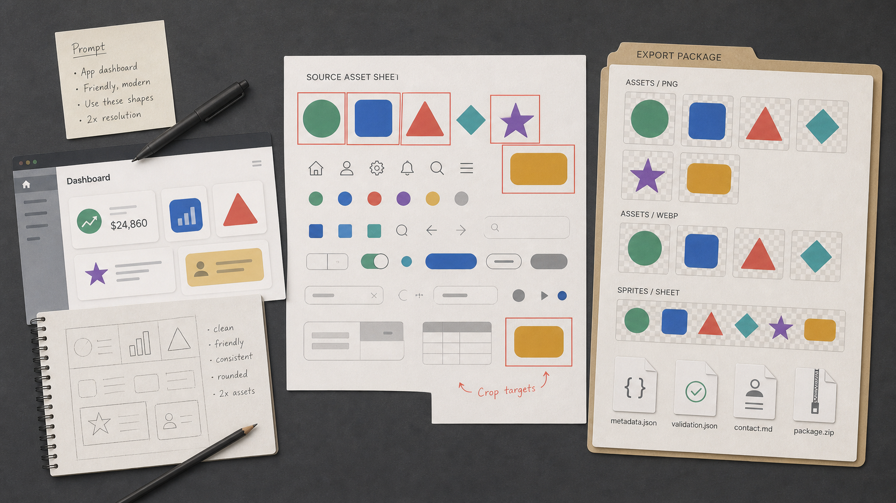
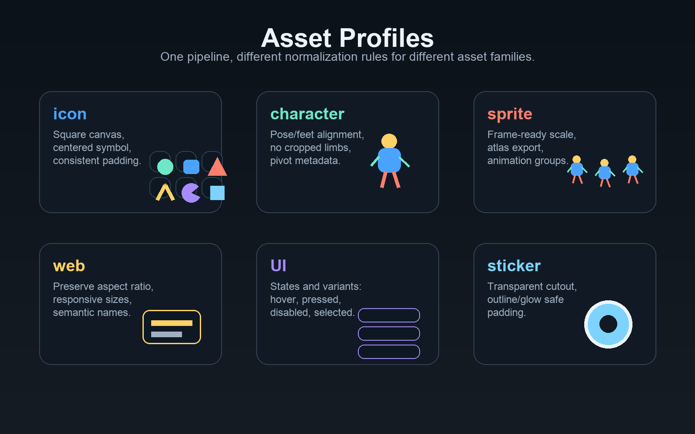
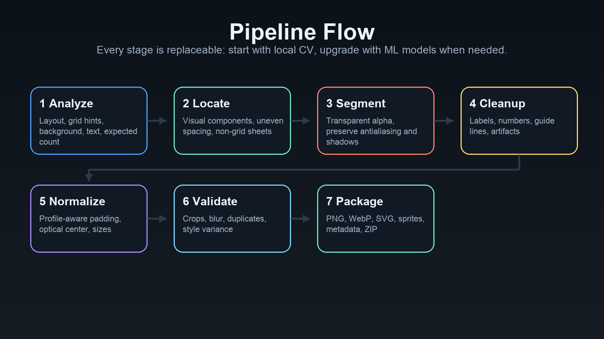
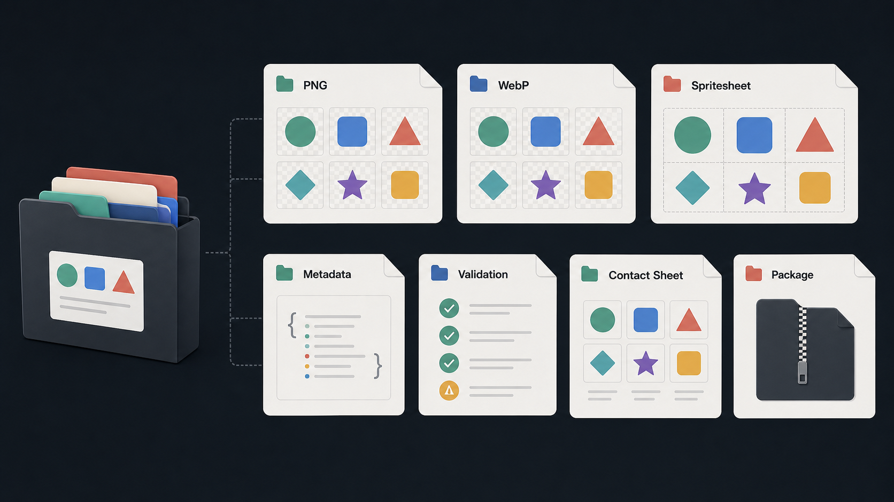
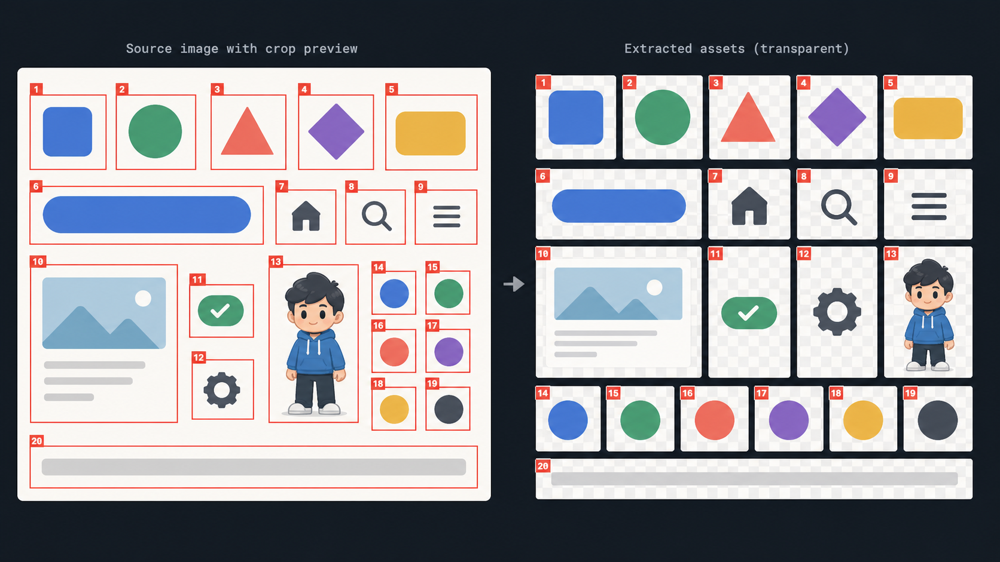

# Visual Asset Pipeline



**Visual Asset Pipeline** turns prompts, dense asset sheets, webpage captures, sketches, and folders of images into production-ready asset packages for design tools, apps, websites, and game engines.

[English](../../README.md) | [한국어](../../README.ko.md) | [日本語](README.ja.md) | [简体中文](README.zh-CN.md) | [Español](README.es.md)

> Status: alpha. The local pipeline is working, modular, and test-covered for smoke extraction. Model-backed segmentation, semantic naming, OCR, and SVG conversion are designed as replaceable adapters.

## What It Handles

Visual Asset Pipeline is not limited to icons. Icons are one supported profile.

- Icons and symbol packs
- Character sheets and pose boards
- Sprite sheets and game props
- Webpage or landing-page visual assets
- UI badges, buttons, state variants, and app assets
- Stickers, decals, emotes, and transparent cutouts



## Pipeline



Korean process walkthrough: [Visual Asset Pipeline 프로세스 설명](../process.ko.md)

1. Analyze input: layout, background, text, spacing, grid hints, and expected count.
2. Locate assets visually: do not rely only on equal grid cells.
3. Segment foreground: remove backgrounds while preserving antialiasing, shadows, outlines, and glows.
4. Cleanup: remove captions, labels, numbers, guide lines, and small artifacts.
5. Normalize: use profile-aware padding, optical centering, and requested export sizes.
6. Validate: flag cropped edges, blur, duplicates, text residue, background artifacts, and style variance.
7. Package: export PNG, WebP, optional SVG, sprite sheets, metadata, validation reports, contact sheet, and ZIP.

## Output Package



Each run can produce:

- `png/<size>/*.png`
- `webp/<size>/*.webp`
- `svg/*.svg` when a vectorizer is available
- `sprites/sprite_<size>.png`
- `sprites/sprite_<size>.json`
- `metadata.json`
- `validation_report.json`
- `contact_sheet.png`
- `crop_preview.png`
- `visual_asset_package.zip`

The output is intended for Figma, React, Flutter, iOS, Android, web apps, Unity, Godot, and other game engines.

## Crop Preview Overlay



Extraction runs write `crop_preview.png` beside the exported assets. Red boxes show the final padded crop area, faint white boxes show the raw visual detection, and numbered labels map the preview back to metadata. This makes it obvious when a cut is too tight before the files move into Figma, apps, or game engines.

## Install

### Python

```bash
git clone https://github.com/Jun0zo/visual-asset-pipeline.git
cd visual-asset-pipeline
python3 -m venv .venv
source .venv/bin/activate
python3 -m pip install -e ".[dev]"
```

Verify the install:

```bash
visual-asset-pipeline --help
pytest
```

The short alias is also available:

```bash
vap --help
```

### npm / npx

The npm package provides a small Node.js CLI wrapper around the Python pipeline. On install, it tries to create a package-local Python virtual environment and install the Python dependencies there.

```bash
npm install -g github:Jun0zo/visual-asset-pipeline
vap --help
```

For one-off usage:

```bash
npx --yes github:Jun0zo/visual-asset-pipeline --help
```

Set `VAP_SKIP_PYTHON_INSTALL=1` before `npm install` if you want to manage the Python environment yourself.

## Quick Start

Create a generation brief from a prompt:

```bash
visual-asset-pipeline brief \
  --prompt "Create 48 forest exploration icons in watercolor style." \
  --profile icon \
  --output work/forest-assets
```

Generate an image sheet from `work/forest-assets/generation_brief.json` with your image model, then extract assets:

```bash
visual-asset-pipeline extract \
  --input work/forest-assets/generated-sheet.png \
  --output work/forest-assets/export \
  --prompt "Create 48 forest exploration icons in watercolor style." \
  --profile icon \
  --expected-count 48 \
  --sizes 128,256,512,1024
```

Normalize a folder of already-separated assets:

```bash
visual-asset-pipeline normalize \
  --input work/raw-assets \
  --output work/normalized-assets \
  --profile web \
  --sizes 256,512
```

Package a character sheet:

```bash
visual-asset-pipeline extract \
  --input work/character-sheet.png \
  --output work/character-pack \
  --profile character \
  --expected-count 12 \
  --sizes 512,1024
```

## Asset Profiles

| Profile | Best for | Normalization intent |
| --- | --- | --- |
| `icon` | Symbol packs, app icons, badges | Square canvas, centered symbol, consistent padding |
| `character` | Character poses, mascots, avatar sheets | Preserve full body, align visual weight, avoid cropped limbs |
| `sprite` | Game frames, props, effects | Frame-ready scale, sprite sheet export, atlas metadata |
| `web` | Landing-page images, logos, illustrations | Preserve useful shape, responsive export sizes |
| `ui` | Buttons, badges, states, app visuals | Group variants and keep state-friendly naming |
| `sticker` | Stickers, emotes, decals | Preserve outline/glow and generous transparent padding |
| `auto` | Unknown or mixed sheets | Use conservative general-purpose extraction |

## Codex Skill

The installable Codex Skill is included at `skill/visual-asset-pipeline`.

Install it locally:

```bash
cp -R skill/visual-asset-pipeline "${CODEX_HOME:-$HOME/.codex}/skills/"
```

Then invoke it in Codex with:

```text
Use $visual-asset-pipeline to extract this character sheet into transparent PNG, WebP, sprite sheet, ZIP, and metadata.
```

## Architecture

```text
src/visual_asset_pipeline/
├── analysis.py        # input inspection and layout metadata
├── detection.py       # visual asset localization
├── segmentation.py    # foreground masks and background removal
├── cleanup.py         # captions, guide lines, artifacts, and noise
├── normalization.py   # optical centering and profile-aware canvas export
├── validation.py      # quality gates, duplicates, and style checks
├── naming.py          # deterministic semantic filenames
├── packaging.py       # image exports, metadata, reports, sprites, ZIP
└── cli.py             # command line interface
```

More detail:

- [Architecture](../architecture.md)
- [Library recommendations](../library-recommendations.md)
- [Name candidates](../name-candidates.md)

## Optional Enhancements

The default pipeline runs locally with Pillow, NumPy, and scikit-image. Production deployments can swap in:

- SAM, RMBG, or rembg for segmentation
- CLIP, SigLIP, DINOv2, or a multimodal LLM for semantic naming and duplicate detection
- OCR for stronger caption and label removal
- vtracer, potrace, Illustrator, or a hosted vectorization service for SVG output
- Figma, React, Flutter, iOS, Android, Unity, Godot, and TexturePacker code generators

## Development

```bash
python3 -m pip install -e ".[dev]"
pytest
npm pack --dry-run
```

## Roadmap

- Profile-specific metadata: pivots, hitboxes, 9-slice, state groups, animation groups.
- Model-backed extraction adapters.
- True vector export pipeline.
- Multimodal semantic naming review UI.
- Figma plugin export.
- Framework and game-engine codegen.
- Visual regression benchmark suite with real-world asset sheets.
